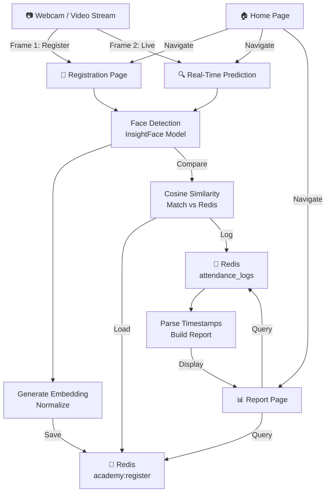

# Face Recognition Attendance System

A Streamlit-based attendance application that uses face embeddings, Redis, and real-time camera capture to register users, recognize them live, and generate attendance reports. The app also supports importing simulated attendance logs for testing and report generation.

## Introduction

Attendance management is a fundamental process in organizations and educational institutions. Traditional methods such as manual registers or ID-based systems are time-consuming, error-prone, and susceptible to manipulation (e.g., proxy attendance).

This project introduces an automated attendance system using face recognition technology, which leverages computer vision and machine learning to identify individuals and record attendance in real time. The system enhances accuracy, reduces manual effort, and provides a scalable solution for modern environments.

## Objectives

The primary objectives of this project are:

- To automate attendance tracking using facial recognition
- To ensure high accuracy and real-time performance
- To eliminate manual errors and proxy attendance
- To provide a user-friendly web interface for monitoring and management
- To enable easy registration of new users without retraining models
- To generate attendance reports for analysis

## Features

- Real-time face recognition using webcam/video stream input
- Face registration through sample capture and embedding generation
- Redis-backed storage for registered identities and attendance logs
- Local saving and importing of face embeddings in `.npz` or `.txt` format
- Attendance reporting with filtering by date, name, role, duration, and status
- Simulated log import from `simulated_logs.txt` for testing without live camera data

## Tech Stack

- **Frontend/UI:** Streamlit
- **Computer Vision:** OpenCV
- **Face Recognition:** InsightFace
- **Numerical Computing:** NumPy
- **Data Processing:** pandas
- **Machine Learning Similarity Search:** scikit-learn
- **Streaming Camera Input:** streamlit-webrtc, av
- **Database / Cache:** Redis
- **Environment / Config:** Python, os, optional local `.env` support for development

## Project Structure

- `Home.py` - application entry point
- `face_rec.py` - face recognition, Redis access, embedding handling, and log saving logic
- `pages/1_Real_Time_Prediction.py` - live recognition page
- `pages/2_Registration_form.py` - face registration and embedding upload page
- `pages/3_Report.py` - attendance logs, simulated logs, and report generation page
- `local_embeddings/` - local embedding files saved from the registration workflow
- `insightface_model/` - local InsightFace model files
- `simulated_logs.txt` - sample attendance log dataset used for testing and demos

## System Architecture

The application follows a simple three-layer flow:

1. **Capture Layer**
   - The webcam feed is opened through Streamlit WebRTC.
   - Frames are sent to the recognition and registration logic.

2. **Processing Layer**
   - `face_rec.py` prepares the InsightFace model.
   - During registration, face samples are collected and averaged into a normalized embedding.
   - During recognition, each detected face embedding is compared against the registered Redis embeddings using cosine similarity.

3. **Storage and Reporting Layer**
   - Registered identities are stored in Redis under `academy:register`.
   - Attendance logs are stored in Redis under `attendance_logs`.
   - The report page reads log entries, parses timestamps, and builds summaries and filters.

### High-Level Flow



## How the Application Works

### Phase 1: Registration Phase

1. User captures multiple samples of their face via the webcam
2. The system extracts facial features (embeddings) from each sample
3. Embeddings are normalized and averaged into a single representative vector
4. The final embedding is stored in Redis under the user's identity
5. Optionally, embeddings can be exported locally as `.npz` or `.txt` files

### Phase 2: Inference (Recognition) Phase

1. Live video stream from the webcam is continuously processed
2. Faces are detected using InsightFace model
3. Each detected face is converted into an embedding vector
4. The embedding is compared against all registered embeddings using cosine similarity
5. If similarity exceeds the threshold, attendance is marked with name and timestamp
6. If no match is found, the person is marked as "Unknown"
7. All recognition events are logged to Redis

### Detailed Workflow

#### 1. Registration

- Open the Registration Form page.
- Enter a name and choose a role (Student/Teacher).
- Position face in the frame and capture enough samples from the webcam.
- The app collects and normalizes the embeddings.
- The final embedding can be saved to Redis and optionally exported locally as `.npz` or `.txt`.

#### 2. Real-Time Prediction

- Open the Real Time Prediction page.
- The app loads all registered embeddings from Redis.
- Each detected face is converted to an embedding.
- The embedding is compared against registered users using cosine similarity.
- If a match is found, the person name and role are displayed on the frame with a bounding box.
- Attendance events are collected and written to Redis as logs every 30 seconds.

#### 3. Reports

- Open the Report page.
- Registered Redis identities can be reviewed in the "Registered Data" tab.
- Attendance logs are loaded from Redis and converted into a dataframe in the "Logs" tab.
- The "Attendance Report" tab aggregates first in-time (check-in) and last out-time (check-out) per person per day.
- Status markers indicate: Absent, Half Day, or Present based on duration.
- Advanced filtering supports searching by date, name, role, duration, and status.

#### 4. Simulated Logs

- The report page can import `simulated_logs.txt` into Redis.
- This is useful when testing the reporting flow without recording live webcam attendance.
- The simulated file uses the same log format as live attendance entries.

## Working Methodology

### Step 1: Face Detection
- Detect faces in images/video frames using InsightFace pre-trained model
- Extract bounding boxes for each face

### Step 2: Feature Extraction
- Convert faces into high-dimensional numerical vectors (embeddings)
- Each face is represented as a 512-dimensional feature vector
- Features capture unique facial characteristics invariant to lighting, pose, etc.

### Step 3: Embedding Normalization
- Average multiple embeddings from the same person
- Normalize the vector to unit length for consistent comparison
- Store normalized embedding in Redis

### Step 4: Face Matching
- Compare incoming face embeddings with stored ones
- Use cosine similarity metric (range: 0 to 1, where 1 = identical)
- Apply similarity threshold (default: 0.5) to determine match

### Step 5: Attendance Marking
- If match found: Record name + role + timestamp in Redis list
- If no match: Mark as "Unknown" and log the event
- Deduplicate logs per person within a time window to avoid multiple entries from same face

## Database Design (Redis)

### Why Redis?

- **In-memory storage**: Provides extremely fast read/write operations
- **Simple data structures**: Supports strings, hashes, lists, sets, sorted sets
- **Ideal for real-time applications**: No disk I/O latency for frequent access
- **Scalability**: Handles thousands of concurrent reads efficiently
- **Session management**: Perfect for temporary and semi-persistent data

### Data Structures Used

**Hashes** - Store registered face embeddings:
```
Key: academy:register
Field: Name@Role
Value: Binary embedding (byte array)
```

**Lists** - Store attendance log entries:
```
Key: attendance_logs
Elements: Name@Role@YYYY-MM-DD HH:MM:SS
```

**Strings** (optional) - Store user metadata:
```
Each user profile can contain name, role, registration date
```

## Web Application Interface (Streamlit)

The system includes a user-friendly web interface built with Streamlit that provides:

### 1. Home Page
- Application status and health check
- Redis connection status
- Links to all modules

### 2. Registration Module
- **Capture Interface**: Real-time webcam feed with sample counter
- **Progress Tracking**: Visual progress bar, sample count, remaining samples
- **Upload Options**: Save embeddings locally as NPZ or TXT format
- **Local File Import**: Upload previously saved embeddings directly to Redis
- **Metadata Input**: Name and role selection
- **Reset Function**: Clear samples to recapture

### 3. Real-Time Attendance Module
- **Live Video Stream**: WebRTC-enabled camera feed
- **Face Overlay**: Bounding boxes and name labels for recognized faces
- **Timestamp Display**: Current date/time on each frame
- **Database Status**: Shows registered identities count
- **Auto-Logging**: Attendance events logged every 30 seconds

### 4. Reports Module

**Registered Data Tab:**
- View all registered users and their embeddings
- Refresh to update from Redis in real-time

**Logs Tab:**
- View raw attendance log entries
- Import simulated logs from `simulated_logs.txt` for testing
- Automatic timestamp normalization for logs with fractional seconds

**Attendance Report Tab:**
- Aggregate view: In-time and out-time per person per day
- Duration calculation in seconds and hours
- Status classification: Absent / Half Day / Present
- Advanced filtering panel with multiple criteria
- Complete report export view

## Log Format

Attendance logs use the standardized format:

```text
Name@Role@YYYY-MM-DD HH:MM:SS
```

Example:
```text
Sudheer@Student@2023-11-01 08:16:19
Angelina Jolie@Student@2023-11-01 16:35:24
Morgan Freeman@Teacher@2023-11-02 08:16:56
```

**Note:** Some imported logs may contain fractional seconds (e.g., `2023-11-01 08:16:19.462781`). The report page automatically normalizes these values before datetime conversion.

## Advantages

✅ **Eliminates Proxy Attendance**: Face recognition makes spoofing nearly impossible  
✅ **Saves Time and Effort**: Automated process vs. manual roll calls  
✅ **High Accuracy and Reliability**: ML-based matching with configurable thresholds  
✅ **Easy to Use**: Simple web interface, no special training needed  
✅ **Scalable System Design**: No model retraining required for new users  
✅ **Real-Time Monitoring**: Instant feedback and logging  
✅ **No Retraining Needed**: Add new users without model updates  
✅ **Flexible Deployment**: Works with local or cloud Redis  

## Limitations

⚠️ **Lighting Conditions**: Performance may degrade in poor or inconsistent lighting  
⚠️ **Camera Quality**: Requires good quality camera for optimal accuracy  
⚠️ **Privacy Concerns**: Facial data storage raises privacy and compliance issues  
⚠️ **Memory Constraints**: Redis is in-memory; ensure sufficient RAM for scale  
⚠️ **Face Obstructions**: Accuracy drops with masks, heavy glasses, or accessories  
⚠️ **Age Variation**: System may struggle with significant age changes  
⚠️ **Backend Dependency**: Relies heavily on Redis availability  

## Applications

- 🏫 **Schools and Colleges**: Automated student attendance tracking
- 🏢 **Offices and Corporate Environments**: Employee check-in/check-out
- 🔐 **Secure Access Control**: Controlled entry to restricted areas
- 🎪 **Event Management**: Attendee verification and tracking
- 📹 **Smart Surveillance**: Recognition-based security monitoring
- 🏥 **Hospitals**: Patient and staff tracking
- 🏦 **Banks and Financial Institutions**: Visitor and employee monitoring

## Setup

### Prerequisites

- Python 3.10.x
- Redis server or Redis Cloud access
- Webcam access for registration and recognition

### Installation

1. Create and activate a virtual environment.
2. Install dependencies from `requirements.txt`.
3. Make sure Redis is available.
4. Configure Redis connection details using your preferred local method.
5. Run the app:

```powershell
python -m venv .venv
.\.venv\Scripts\activate
pip install -r requirements.txt
streamlit run Home.py
```

### Optional Local Data

- `simulated_logs.txt` can be used to seed the Redis attendance log list for testing.
- Local embeddings saved in `local_embeddings/` can be pushed back into Redis from the Registration page.

## Important Notes

- The project is optimized for **Python 3.10.x** due to library compatibility constraints
- `insightface` and `opencv-python` are not compatible with Python 3.13 in this setup
- Keep local secrets and Redis credentials out of version control (use `.env` for local development only)
- The `simulated_logs.txt` file is intended for demo and testing purposes
- Ensure sufficient system memory for embedding storage in Redis
- Use a stable internet connection when connecting to Redis Cloud

## Fast Face Recognition Model Advantages

Unlike traditional models, this system uses a fast face recognition approach:

✨ **No need for large datasets** - Works with single samples  
✨ **No retraining required** - Add new users on-the-fly  
✨ **Faster processing** - Direct embedding comparison  
✨ **Better scalability** - Linear scaling with user count  

**Process Flow:** Extract features → Store in database → Compare during runtime

## Future Enhancements

🔮 **Cloud Database Integration**: Replace Redis with cloud services (DynamoDB, Firestore)  
📱 **Mobile Application Support**: Native mobile apps for better accessibility  
😷 **Masked Face Recognition**: Handle faces with masks and accessories  
🎥 **Multi-Camera Support**: Federated attendance across multiple locations  
📊 **Advanced Analytics**: AI-based insights on attendance patterns  
💰 **Payroll Integration**: Direct sync with HR and payroll systems  
🌐 **Batch Processing**: Import/export attendance data in bulk  
🔔 **Notifications**: Real-time alerts for unauthorized access  
🔐 **Enhanced Security**: Liveness detection to prevent spoofing with photos  
📈 **Dashboard Analytics**: Visualization of attendance trends and anomalies  

## Conclusion

The Attendance System using Face Recognition is an efficient and intelligent solution that modernizes traditional attendance methods. By combining computer vision, machine learning, and a fast in-memory database system, the project achieves real-time, accurate, and scalable attendance tracking.

This system demonstrates how emerging technologies such as deep learning and face embeddings can be effectively applied to solve real-world problems in educational and organizational environments. The modular design allows organizations to adopt the system at scale without significant infrastructure changes.

### Key Takeaways

- **Modern Solution**: Replaces outdated manual processes with automated intelligence
- **Production-Ready**: Uses proven technologies (InsightFace, Redis, Streamlit)
- **Privacy-Conscious**: Stores only embeddings, not actual images
- **Developer-Friendly**: Well-documented codebase for customization and extension
- **Highly Scalable**: Redis architecture allows handling of large user bases

Whether deployed in schools, offices, or secure facilities, this system provides a foundation for automatic, reliable attendance tracking while demonstrating best practices in real-time ML applications.
